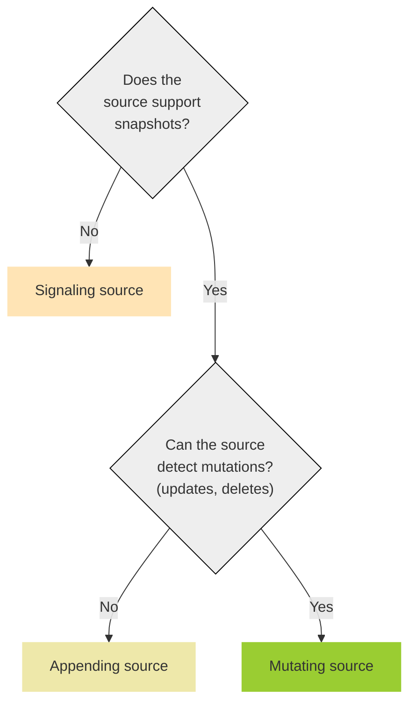
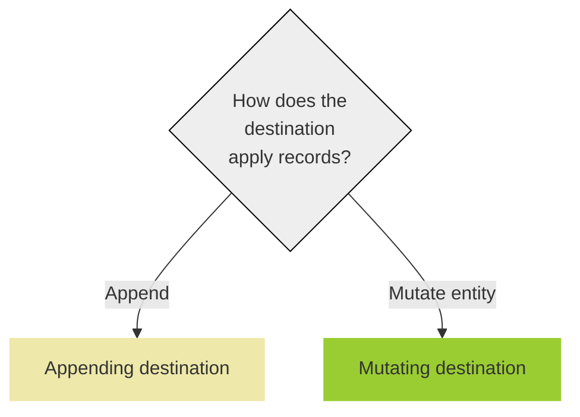

# Acceptance tests

This document describes one possible approach for writing acceptance tests for Conduit
connectors. We discovered the need to revisit this when integrating the OpenCDC record
into the SDK, since the new record format fully enables the implementation of mutating
connectors.

The main challenge is that 3rd party systems have different capabilities, it is not
always possible to write a fully fledged mutable connector. Therefore the acceptance
tests need to be flexible and adjust their expectations based on what the 3rd party
system is capable of. At first it's probably simplest to let the developer specify
which category the connector falls into and which tests should be run. In the future
it would be ideal if we can detect the category automatically.

We also need to confirm that the way we randomly generate records and how we assert
them makes sense for all connectors.

This document should serve as a basis for discussion, it does not explain the current
implementation, nor should it be taken as the one single truth for how we should
approach the writing of acceptance tests.

## Source

All source tests are executed with structured records. The reason is that not all destinations are able to consume unstructured raw data, while structured data should be supported by any destination connector. We should give the user control over field names in the structured record in case the connector expects specific field names that match the target structure.

| Test                                                 |  |  |  |
| ---------------------------------------------------- | ------------------------------------------------------------------------------------------------ | ----------------------------------------------------------------------------------------------------- | -------------------------------------------------------------------------------------------------- |
| **General tests**                                    | :white_check_mark:                                                                               | :white_check_mark:                                                                                    | :white_check_mark:                                                                                 |
| Test 1 - configure                                   | :white_check_mark:                                                                               | :white_check_mark:                                                                                    | :white_check_mark:                                                                                 |
| Test 2 - configure without required parameters       | :white_check_mark:                                                                               | :white_check_mark:                                                                                    | :white_check_mark:                                                                                 |
| Test 3 - read timeout                                | :white_check_mark:                                                                               | :white_check_mark:                                                                                    | :white_check_mark:                                                                                 |
| **Can the source connector detect creations (CDC)?** | :white_check_mark:                                                                               | :white_check_mark:                                                                                    | :white_check_mark:                                                                                 |
| Test 1 - detect 1 record                             | :white_check_mark:                                                                               | :white_check_mark:                                                                                    | :white_check_mark:                                                                                 |
| Test 2 - detect X records                            | :white_check_mark:                                                                               | :white_check_mark:                                                                                    | :white_check_mark:                                                                                 |
| **Can the source connector produce a snapshot?**     |                                                                                                  | :white_check_mark:                                                                                    | :white_check_mark:                                                                                 |
| Test 1 - detect 1 record                             |                                                                                                  | :white_check_mark:                                                                                    | :white_check_mark:                                                                                 |
| Test 2 - detect X records                            |                                                                                                  | :white_check_mark:                                                                                    | :white_check_mark:                                                                                 |
| **Can the source connector resume at position?**     |                                                                                                  | :white_check_mark:                                                                                    | :white_check_mark:                                                                                 |
| Test 1 - resume partial snapshot                     |                                                                                                  | :white_check_mark:                                                                                    | :white_check_mark:                                                                                 |
| Test 2 - resume partial CDC                          |                                                                                                  | :white_check_mark:                                                                                    | :white_check_mark:                                                                                 |
| Test 3 - detect write between restarts               |                                                                                                  | :white_check_mark:                                                                                    | :white_check_mark:                                                                                 |
| **Can the source detect mutations?**                 |                                                                                                  |                                                                                                       | :white_check_mark:                                                                                 |
| Test 1 - detect update                               |                                                                                                  |                                                                                                       | :white_check_mark:                                                                                 |
| Test 2 - detect delete                               |                                                                                                  |                                                                                                       | :white_check_mark:                                                                                 |

### General tests

Expected to pass:

* **Test 1** - configure
  1. Open source
  1. Call Configure with valid configuration
  1. Expect no error
* **Test 2** - configure without required parameters
  1. Open source
  1. Call Configure with a required field removed
  1. Expect error
* **Test 3** - read timeout
  1. Open source
  1. Read record, timeout in X seconds
  1. Expect no records

### Can the source connector detect creations (CDC)?

Expected to pass:

Records in these tests contain operation "create" or "snapshot", the reason is that  won't append the record if it receives a "delete" or "update".

* **Test 1** - detect 1 record
  1. Open source
  1. Write 1 record to destination
  1. Read 1 record from source
  1. Expect 1 record
* **Test 2** - detect X records
  1. Open source
  1. Write X unrelated records to destination
  1. Read all records from source
  1. Expect X records

### Can the source connector produce a snapshot?

Expected to pass:

Signaling connectors only work "in the moment", they are not expected to be able to create a snapshot. Records in these tests contain operation "create" or "snapshot".

* **Test 1** - detect 1 record
  1. Write 1 record to destination
  1. Open source
  1. Read 1 record
  1. Expect 1 record
* **Test 2** - detect X records
  1. Write X unrelated records to destination
  1. Open source
  1. Read all records
  1. Expect X records

### Can the source connector resume at position?

Expected to pass:

Signaling connectors only work "in the moment", they are not expected to be able to create a snapshot. Records in these tests contain operation "create" or "snapshot".

* **Test 1** - resume partial snapshot
  1. Write X unrelated records to destination
  1. Open source
  1. Read all records, acknowledge X/2 records
  1. Tear down source
  1. Open new source at position X/2
  1. Read all records
  1. Expect X (snapshot is restarted) or X/2 (snapshot is resumed) records
* **Test 2** - resume partial CDC
  1. Open source
  1. Write X unrelated records to destination
  1. Read all records, acknowledge X/2 records
  1. Tear down source
  1. Open new source at position X/2
  1. Read all records
  1. Expect X/2 records
* **Test 3** - detect write between restarts
  1. Open source
  1. Write 1 unrelated record to destination
  1. Read 1 record from source
  1. Tear down source
  1. Write 1 unrelated record to destination
  1. Open new source at position 1
  1. Read 1 record from source
  1. Expect 1 record

### Can the source detect mutations?

Expected to pass:

In these tests we should be lenient regarding the expectation of an "update" record. Not all systems are capable of producing a diff, so it's not always possible to populate the `before.payload` field of an OpenCDC record. We should still make sure that `before.key` is populated, because that is the main identifier of an entity in an "update" record.

* **Test 1** - detect update
  1. Open source
  1. Write 1 record to destination
  1. Write same record with a changed payload and operation "update" to destination
  1. Read 2 records from source
  1. Expect 2 records (one "create" and one "update")
* **Test 2** - detect delete
  1. Open source
  1. Write 1 record to destination
  1. Write same record with operation "delete" to destination
  1. Read 2 records from source
  1. Expect 2 records (one "create" and one "delete")

## Destination

| Test                                                         |  |  |
| ------------------------------------------------------------ | ---------------------------------------------------------------------------------------------------------- | ------------------------------------------------------------------------------------------------------- |
| **General tests**                                            | :white_check_mark:                                                                                         | :white_check_mark:                                                                                      |
| Test 1 - configure                                           | :white_check_mark:                                                                                         | :white_check_mark:                                                                                      |
| Test 2 - configure without required parameters               | :white_check_mark:                                                                                         | :white_check_mark:                                                                                      |
| **Can the destination connector write structured records?**  | :white_check_mark:                                                                                         | :white_check_mark:                                                                                      |
| Test 1 - detect 1 structured record                          | :white_check_mark:                                                                                         | :white_check_mark:                                                                                      |
| Test 2 - detect X structured records                         | :white_check_mark:                                                                                         | :white_check_mark:                                                                                      |
| **Can the destination connector write raw records?**         | :white_check_mark:                                                                                         | :white_check_mark:*                                                                                     |
| Test 1 - detect 1 raw record                                 | :white_check_mark:                                                                                         | :white_check_mark:*                                                                                     |
| Test 2 - detect X raw records                                | :white_check_mark:                                                                                         | :white_check_mark:*                                                                                     |
| **Does the destination connector mutate entities in place?** |                                                                                                            | :white_check_mark:                                                                                      |
| Test 1 - apply delete                                        |                                                                                                            | :white_check_mark:                                                                                      |
| Test 2 - apply update                                        |                                                                                                            | :white_check_mark:                                                                                      |

\* A mutating destination should _probably_ support writing raw records, but it shouldn't be a hard requirement. For instance a DB destination connector might need structured data to map values to columns.

### General tests

Expected to pass:

* **Test 1** - configure
  1. Open destination
  1. Call Configure with valid configuration
  1. Expect no error
* **Test 2** - configure without required parameters
  1. Open destination
  1. Call Configure with a required field removed
  1. Expect error

### Can the destination connector write structured records?

Expected to pass:

* **Test 1** - detect 1 structured record
  1. Open source
  1. Write 1 structured record to destination
  1. Read 1 record from source
  1. Expect 1 raw or structured record
* **Test 2** - detect X structured records
  1. Open source
  1. Write X unrelated structured records to destination
  1. Read all records from source
  1. Expect X raw or structured records

### Can the destination connector write raw records?

Expected to pass:

*

* **Test 1** - detect 1 raw record
  1. Open source
  1. Write 1 raw record to destination
  1. Read 1 record from source
  1. Expect 1 raw record
* **Test 2** - detect X raw records
  1. Open source
  1. Write X unrelated raw records to destination
  1. Read all records from source
  1. Expect X raw records

### Does the destination connector mutate entities in place?

Expected to pass:

These tests are executed both with raw and structured data.

* **Test 1** - apply delete
  1. Write 1 raw record to destination
  1. Write same record with operation "delete" to destination
  1. Open source
  1. Try read 1 record
  1. Expect 0 records (timeout)
* **Test 2** - apply update
  1. Write 1 raw record to destination
  1. Write same record with operation "update" to destination
  1. Open source
  1. Read 1 record
  1. Expect 1 record (contains data from update)

## Specifier

Specifications are required for all connectors.

* **Test 1** - specification exists
  1. Get specification
  1. Expect to get _something_
* **Test 2** - check fields
  1. Get specification
  1. Validate individual fields (some expect a specific format, some are required)
